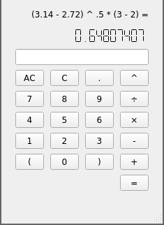

# Qt Calculator

It's a calculator! 

Infix input, parsed to RPN via the shunting yard algorithm for evaluation. 

Written in C++ / Qt.

## Features

- Infix input
- GUI entry
- Keyboard input
- Arithmetic operations (+, -, \*, /, ^)
- Grouping (parentheses)
- Clear (backspace) / Clear All (ctrl-backspace)
- Syntax error / zero division handling

## Usage

Make and run!

```
make
./calculator
```

## Screenshots

How beautiful :blush:



Oh no!


